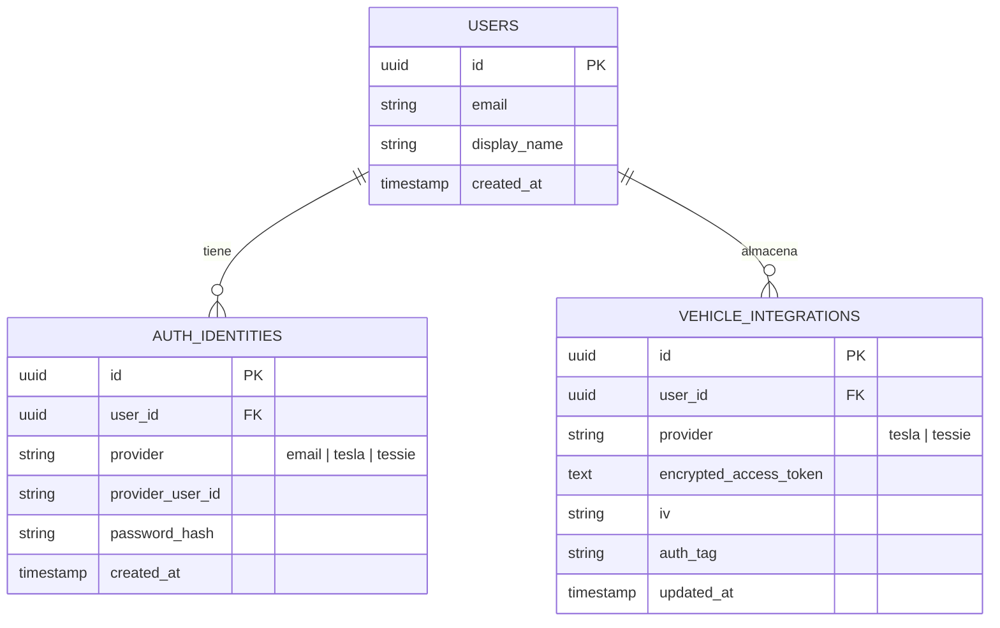

# Arquitectura del Sistema de Autenticación Multi-Método (Tietar)

Este documento detalla el diseño técnico, la estructura de base de datos y la implementación para soportar múltiples proveedores de identidad en **Tietar**:
1. **Autenticación con Email y Contraseña** (cuentas locales/nube)
2. **Autenticación con Token de Tessie API**
3. **Autenticación con Token de Tesla Fleet / Owner API**

---

## 1. Diseño de Base de Datos (PostgreSQL)

El sistema utiliza el patrón *Identity Provider Mapping*, separando la entidad `users` de las credenciales en `auth_identities` y de las integraciones vehiculares cifradas en `vehicle_integrations`.



### DDL SQL

```sql
CREATE EXTENSION IF NOT EXISTS "uuid-ossp";

CREATE TABLE users (
    id UUID PRIMARY KEY DEFAULT uuid_generate_v4(),
    email VARCHAR(255) UNIQUE,
    display_name VARCHAR(100),
    created_at TIMESTAMP WITH TIME ZONE DEFAULT NOW(),
    updated_at TIMESTAMP WITH TIME ZONE DEFAULT NOW()
);

CREATE TABLE auth_identities (
    id UUID PRIMARY KEY DEFAULT uuid_generate_v4(),
    user_id UUID NOT NULL REFERENCES users(id) ON DELETE CASCADE,
    provider VARCHAR(20) NOT NULL CHECK (provider IN ('email', 'tesla', 'tessie')),
    provider_user_id VARCHAR(255) NOT NULL,
    password_hash VARCHAR(255),
    created_at TIMESTAMP WITH TIME ZONE DEFAULT NOW(),
    CONSTRAINT uq_provider_identity UNIQUE (provider, provider_user_id)
);

CREATE INDEX idx_identities_lookup ON auth_identities (provider, provider_user_id);

CREATE TABLE vehicle_integrations (
    id UUID PRIMARY KEY DEFAULT uuid_generate_v4(),
    user_id UUID NOT NULL REFERENCES users(id) ON DELETE CASCADE,
    provider VARCHAR(20) NOT NULL CHECK (provider IN ('tesla', 'tessie')),
    encrypted_access_token TEXT NOT NULL,
    encrypted_refresh_token TEXT,
    iv VARCHAR(32) NOT NULL,
    auth_tag VARCHAR(32) NOT NULL,
    expires_at TIMESTAMP WITH TIME ZONE,
    updated_at TIMESTAMP WITH TIME ZONE DEFAULT NOW(),
    CONSTRAINT uq_user_vehicle_integration UNIQUE (user_id, provider)
);
```

---

## 2. Flujo de Autenticación de Tessie

1. **Recepción del Token**: El cliente envía `{ accessToken: "..." }` al endpoint `/api/auth/login/tessie`.
2. **Validación con Tessie**: El backend realiza una petición `GET https://api.tessie.com/vehicles` con el header `Authorization: Bearer <accessToken>`.
3. **Extracción de Identidad**: Si la respuesta es exitosa (código 200), se extrae la lista de vehículos y el identificador único (`vin` del vehículo principal o ID de cuenta).
4. **Cifrado de Tokens**: Se cifra el token con **AES-256-GCM** y se guarda en `vehicle_integrations`.
5. **Generación de Sesión**: Se emite un JWT firmado por la aplicación con el `user_id`.

---

## 3. Cifrado y Seguridad

- **Contraseñas**: Hasheadas mediante **Argon2id** (o **bcrypt** con coste >= 12).
- **Tokens de Tesla / Tessie**: Cifrados en reposo mediante **AES-256-GCM** utilizando un Vector de Inicialización (`iv`) criptográfico aleatorio por cada fila y clave maestra de 256 bits (`APP_ENCRYPTION_KEY`).
